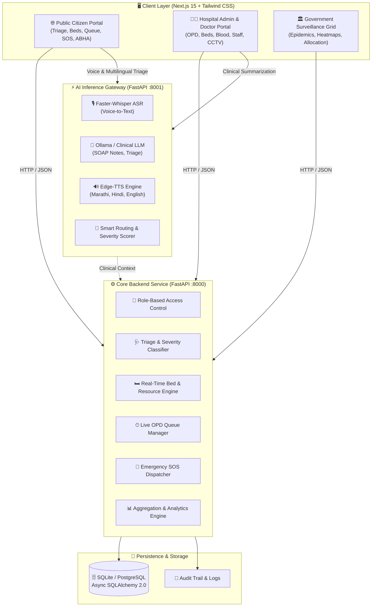

# 🏥 MahaArogya — Sanjeevani Grid

> **AI-Assisted Public Healthcare Routing, Intelligent Triage & Multi-Facility Coordination Platform**  
> *Empowering public healthcare delivery across Maharashtra with real-time bed visibility, multilingual AI intake, smart OPD queuing, emergency SOS routing, and state-wide epidemic surveillance.*

---

## 📌 Table of Contents

- [Overview](#-overview)
- [System Architecture](#-system-architecture)
- [Core Features & Portals](#-core-features--portals)
  - [1. Public Citizen Portal](#1-public-citizen-portal)
  - [2. Hospital Admin & Clinical Workspace](#2-hospital-admin--clinical-workspace)
  - [3. Government & Public Health Surveillance Grid](#3-government--public-health-surveillance-grid)
- [Tech Stack](#-tech-stack)
- [Project Directory Structure](#-project-directory-structure)
- [Quick Start Guide](#-quick-start-guide)
  - [Prerequisites](#prerequisites)
  - [1. Backend Setup](#1-backend-setup-fastapi)
  - [2. AI Gateway Setup](#2-ai-gateway-setup)
  - [3. Frontend Setup](#3-frontend-setup-nextjs-15)
  - [4. Local LLM Setup (Optional)](#4-local-llm-setup-optional)
- [API & Service Endpoints](#-api--service-endpoints)
- [Repository Branch Structure](#-repository-branch-structure)
- [License & Contributing](#-license--contributing)

---

## 🌟 Overview

**MahaArogya (Sanjeevani Grid)** is a next-generation healthcare coordination ecosystem designed to eliminate critical bottlenecks in public health systems:

1. **Hospital Overcrowding & Queue Inefficiencies**: Live OPD queue tracking, digital token dispatch, and crowd density telemetry.
2. **Emergency Routing Delays**: Dynamic hospital triage routing considering real-time ICU/Oxygen bed availability, distance, and facility specialty capabilities.
3. **Multilingual Rural Accessibility**: Voice-first AI intake in **Marathi (मराठी)**, **Hindi (हिंदी)**, and **English**, powered by ASR and neural TTS.
4. **Clinical Documentation Burden**: Automatic doctor-patient consultation transcription and structured SOAP / clinical note generation.
5. **Epidemiological Early Warning**: State-level epidemic outbreak detection, resource heatmaps, and automated inter-hospital inventory rebalancing.

---

## 🏗 System Architecture



---

## 🎯 Core Features & Portals

### 1. Public Citizen Portal
- **Multilingual AI Symptom Triage (`/triage`)**: Conversational or structured symptom input with severity scoring (Emergency, Urgent, Routine), recommended care tier, and instant multilingual voice guidance.
- **GIS Hospital Finder & Bed Tracker (`/hospitals`)**: Interactive Leaflet map of Maharashtra hospitals (KEM, Sion, JJ, Sassoon, etc.) with live counts for General Beds, ICU, HDU, Oxygen, and Pediatric wards.
- **Live OPD Queue Tracker (`/queue`)**: Generate digital OPD tokens, monitor estimated wait times, and receive real-time turn notifications.
- **Emergency SOS Dispatch (`/emergency`)**: One-tap emergency locator connecting citizens to the nearest trauma centers with live capacity.
- **ABHA & Health Records (`/records`)**: View past consultation history, download digital PDF prescriptions, and view diagnostic notes.

### 2. Hospital Admin & Clinical Workspace
- **Hospital Operations Dashboard (`/dashboard`)**: High-level telemetry for admissions, bed occupancy, doctor utilization, and critical triage cases.
- **Doctor Consultation Portal (`/doctor`)**: Integrated clinical workspace featuring voice-to-text transcriptions, AI SOAP summary generation, medicine prescription builder, and one-click PDF generation.
- **OPD Queue Controller (`/opd`)**: Real-time counter management, token calling, priority override for urgent cases, and department routing.
- **Bed Management Matrix (`/beds`)**: Ward-level allocation, patient admissions, transfers, discharges, and real-time status switches.
- **Blood Bank Registry (`/blood-bank`)**: Live units inventory across A+, A-, B+, B-, AB+, AB-, O+, O- with critical reserve threshold warnings.
- **Pharmacy & Consumables (`/pharmacy`)**: Critical stock monitoring (antibiotics, IV fluids, analgesics, emergency injections) and reorder alerts.
- **Facility Resources & Equipment (`/resources`)**: Real-time telemetry for ventilators, dialysis units, oxygen generation plants, and defibrillators.
- **Staff Duty Roster (`/staff`)**: On-duty roster management for doctors, nurses, paramedics, and support staff.
- **CCTV Waiting Room Analytics (`/cctv`)**: AI-assisted crowd density monitoring, waiting hall congestion alerts, and bottleneck detection.
- **Emergency Ambulance Reception (`/admin-emergency`)**: Live incoming ambulance radar, trauma pre-notification, and rapid bay allocation.

### 3. Government & Public Health Surveillance Grid
- **State-Wide Health Grid Overview (`/overview`)**: Macro health metrics across Maharashtra districts (Mumbai, Pune, Nagpur, Nashik, Aurangabad, etc.).
- **Epidemic Outbreak Analytics (`/analytics`)**: Infectious disease trend forecasting (Dengue, Malaria, Gastroenteritis, Respiratory), geographical outbreak heatmaps, and syndromic surveillance.
- **Automated Alerts & Resource Balancing (`/alerts`)**: Early-warning triggers for disease spikes, cross-district ambulance redirection, and mutual-aid resource redistribution.

---

## 💻 Tech Stack

| Layer | Technologies |
|---|---|
| **Frontend Framework** | Next.js 15 (App Router), React 19, TypeScript |
| **Styling & Icons** | Tailwind CSS v4, Lucide React, clsx, tailwind-merge |
| **Mapping & Geospatial** | Leaflet, React-Leaflet, OpenStreetMap |
| **Data Visualization** | Recharts (Area, Bar, Line, Pie charts) |
| **PDF Generation** | jsPDF, jsPDF-AutoTable |
| **Core Backend** | FastAPI, Python 3.10+, Pydantic v2, Loguru |
| **Database & ORM** | SQLAlchemy 2.0 (Async), aiosqlite, SQLite / PostgreSQL |
| **AI Inference Gateway** | FastAPI, PyTorch (CUDA GPU Acceleration) |
| **ASR (Speech-to-Text)** | Faster-Whisper / OpenAI Whisper |
| **LLM & Clinical NLP** | Ollama (`qwen2.5:7b` / custom models), Scikit-Learn |
| **Neural TTS** | Edge-TTS (Marathi `mr-IN`, Hindi `hi-IN`, English `en-IN`) |

---

## 📂 Project Directory Structure

```text
Maha-Arogya---Prototype-1/
├── README.md                     # Monorepo documentation
├── .gitignore                    # Root gitignore for Python, Node & DB files
│
├── frontend/                     # Next.js 15 Frontend Web Application
│   ├── src/
│   │   ├── app/
│   │   │   ├── (public)/         # Citizen portal (triage, hospitals, queue, emergency, records)
│   │   │   ├── (admin)/          # Hospital operations (dashboard, opd, doctor, beds, blood, cctv)
│   │   │   ├── (government)/     # State grid (overview, analytics, alerts)
│   │   │   ├── globals.css       # Design tokens & responsive styles
│   │   │   ├── layout.tsx        # Root HTML layout & language provider
│   │   │   └── page.tsx          # Landing & role selection page
│   │   ├── components/
│   │   │   ├── charts/           # Reusable stats cards & graph components
│   │   │   ├── maps/             # Dynamic Leaflet map components
│   │   │   ├── shared/           # Header, Navigation, Role Switcher, Language Selector
│   │   │   └── ui/               # Cards, Buttons, Badges, Modals, Inputs
│   │   └── lib/
│   │       ├── api.ts            # API client with role headers
│   │       ├── constants.ts      # Application constants & mock fallbacks
│   │       ├── LanguageContext.tsx # EN / HI / MR internationalization
│   │       ├── pdfGenerator.ts   # Client-side medical prescription PDF exporter
│   │       └── store.ts          # State store & demo presets
│   ├── package.json
│   └── tsconfig.json
│
├── backend/                      # FastAPI Core Backend Service
│   ├── requirements.txt          # Python dependencies
│   └── src/
│       ├── main.py               # Application entrypoint & auto-seeding
│       ├── models.py             # SQLAlchemy models (Hospitals, Beds, Patients, Queues, Stock)
│       ├── core/
│       │   ├── config.py         # App settings & environment configurations
│       │   └── database.py       # Async engine & session management
│       ├── routers/
│       │   ├── auth.py           # Authentication & role management
│       │   ├── dashboard.py      # Hospital and state metrics
│       │   ├── emergency.py      # SOS routing & incident logging
│       │   ├── hospitals.py      # Hospital registry & capacity APIs
│       │   ├── patients.py       # Patient database & consultation records
│       │   ├── queue.py          # OPD tokens & waiting room queues
│       │   ├── resources.py      # Beds, blood inventory, equipment status
│       │   └── triage.py         # Rule-based & ML triage endpoints
│       └── seed/
│           └── seed_data.py      # Comprehensive Maharashtra healthcare seed data
│
└── ai-gateway/                   # AI Inference & Multilingual Gateway
    ├── requirements.txt          # AI Gateway dependencies
    └── src/
        ├── main.py               # Gateway entrypoint & GPU detection
        └── routers/
            ├── voice.py          # ASR speech recognition (multilingual)
            ├── clinical.py       # Clinical summarization & SOAP notes
            ├── triage.py         # Intelligent triage reasoning
            ├── routing.py        # Capacity-aware hospital routing
            └── tts.py            # Neural Text-to-Speech synthesizer
```

---

## 🚀 Quick Start Guide

### Prerequisites
- **Node.js**: v18.18+ or v20+
- **Python**: v3.10+
- **Git**: Installed and configured
- *(Optional)* **Ollama**: For local LLM clinical inference

---

### 1. Backend Setup (FastAPI)

```bash
# 1. Navigate to backend directory
cd backend

# 2. Create and activate a virtual environment
python -m venv .venv
# On Windows:
.venv\Scripts\activate
# On Linux/macOS:
source .venv/bin/activate

# 3. Install dependencies
pip install -r requirements.txt

# 4. Start the backend server (automatically initializes & seeds SQLite DB)
uvicorn src.main:app --reload --port 8000
```
- **Backend API**: `http://localhost:8000`
- **Interactive Swagger Docs**: `http://localhost:8000/docs`

---

### 2. AI Gateway Setup

```bash
# 1. Navigate to ai-gateway directory
cd ai-gateway

# 2. Create and activate a virtual environment
python -m venv .venv
# On Windows:
.venv\Scripts\activate
# On Linux/macOS:
source .venv/bin/activate

# 3. Install dependencies
pip install -r requirements.txt

# 4. Start the AI Gateway server
uvicorn src.main:app --reload --port 8001
```
- **AI Gateway API**: `http://localhost:8001`
- **AI Interactive Swagger Docs**: `http://localhost:8001/docs`

---

### 3. Frontend Setup (Next.js 15)

```bash
# 1. Navigate to frontend directory
cd frontend

# 2. Install Node dependencies
npm install

# 3. Start the Next.js development server
npm run dev
```
- **Web Application**: `http://localhost:3000`

---

### 4. Local LLM Setup (Optional)

To enable live local LLM clinical summarization with Ollama:
```bash
# Pull and run the Qwen 2.5 7B model
ollama run qwen2.5:7b
```

---

## 📡 API & Service Endpoints

| Service | Port | Endpoint | Description |
|---|---|---|---|
| **Frontend** | `3000` | `http://localhost:3000` | Next.js Unified Healthcare Web Portal |
| **Backend** | `8000` | `http://localhost:8000/docs` | Swagger OpenAPI Documentation |
| **Backend** | `8000` | `/api/v1/hospitals` | List hospitals with live capacity & bed counts |
| **Backend** | `8000` | `/api/v1/triage/assess` | Rule & ML-based patient triage assessment |
| **Backend** | `8000` | `/api/v1/queue/issue-token` | Issue real-time OPD token |
| **Backend** | `8000` | `/api/v1/emergency/sos` | Trigger emergency dispatch request |
| **Backend** | `8000` | `/api/v1/dashboard/stats` | Hospital & state health metrics |
| **AI Gateway** | `8001` | `http://localhost:8001/docs` | AI Inference Swagger Documentation |
| **AI Gateway** | `8001` | `/ai/voice/transcribe` | Multilingual Whisper speech recognition |
| **AI Gateway** | `8001` | `/ai/clinical/soap` | Generate structured clinical SOAP summary |
| **AI Gateway** | `8001` | `/ai/tts/synthesize` | Edge-TTS neural speech in MR / HI / EN |
| **AI Gateway** | `8001` | `/ai/routing/recommend` | Capacity-aware emergency hospital routing |

---

## 🌿 Repository Branch Structure

This repository is organized into dedicated branches for streamlined development and deployment:

- **`main`**: The consolidated, production-ready monorepo combining `frontend`, `backend`, and `ai-gateway`.
- **`frontend`**: Frontend codebase containing Next.js 15, React components, GIS maps, UI library, and styles.
- **`backend`**: Core FastAPI application, SQLAlchemy models, database migrations, and business logic routers.
- **`ai-gateway`**: AI microservice containing Whisper ASR, Edge-TTS, Clinical NLP, and routing algorithms.

---

## 📄 License & Attribution

Developed for the **MahaArogya Healthcare Initiative**. Designed to modernize public healthcare infrastructure with accessible AI and real-time coordination.
